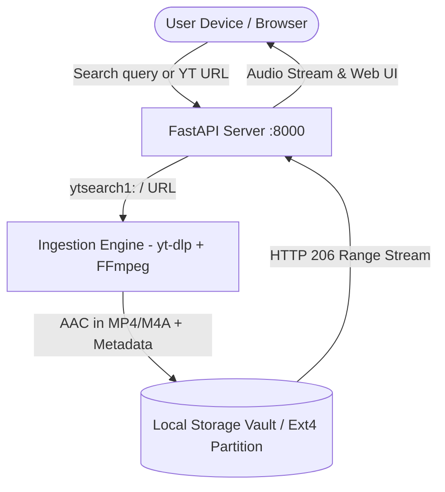

# 🎚️ Fader

> **Stop renting your music.** A lightweight, self-hosted personal music streaming server built from scratch.

## 📖 Overview

Instead of paying a recurring monthly subscription for Spotify or Apple Music, **Fader** turns any spare hard drive or computer on your home network into your private music cloud. 

Type in any song title or YouTube link, and Fader will automatically:
1. Search and resolve the best audio stream via `yt-dlp`.
2. Extract high-quality AAC audio into an MP4 container (`.m4a`/`.mp4`) using `FFmpeg`.
3. Store and index metadata inside your local storage vault.
4. Stream audio seamlessly to any phone, laptop, or browser on your local Wi-Fi with instant scrubbing (**HTTP 206 Partial Content**) — with **zero ads, zero monthly fees, and 100% offline ownership**.

---

## 🎯 The Problems It Solves

- **Streaming Subscription Lock-in:** Streaming platforms charge recurring fees every month; stop paying, and your entire library vanishes.
- **Network & Licensing Dependence:** Platforms frequently pull tracks or full albums over regional licensing disputes. With Fader, audio is stored permanently on your own hard drive.
- **Frictionless Ingestion:** Replaces shady MP3 converter websites, manual downloads, and cable file transfers with automated, single-click search, tagging, and local network serving.

---

## 🏗️ Architecture



### 1. Ingestion Engine (`yt-dlp` + `FFmpeg`)
- Accepts a search string (e.g., `"Starboy"`) or direct YouTube URL.
- Extracts the best audio stream without wasting bandwidth on video data.
- Encodes audio into an AAC stream packaged inside an MP4 audio container.
- Tags metadata (title, artist/uploader, duration) and names files by unique YouTube video ID to prevent broken filenames or collisions.

### 2. Storage Vault
- Files reside inside a dedicated local storage partition (e.g. an ext4 Linux partition formatted to support POSIX permissions, symlinks, and file locking).
- Media files and library caches remain isolated from Git to keep the codebase lightweight.

### 3. Streaming & Web Interface (FastAPI + HTML5 Audio)
- Built on **FastAPI** listening across the local network (`0.0.0.0:8000`).
- Implements **HTTP 206 Partial Content (HTTP Range Requests)**, enabling instant seeking and scrubbing without waiting for full track downloads.
- Modern, responsive web player client for queueing and listening across desktop and mobile devices.

---

## 🚀 Getting Started

### Prerequisites

- **Python 3.10+**
- **FFmpeg** installed on your host system:
  ```bash
  # Ubuntu / Debian
  sudo apt update && sudo apt install -y ffmpeg

  # Arch Linux
  sudo pacman -S ffmpeg

  # macOS
  brew install ffmpeg

  # Windows (via winget or Scoop)
  winget install Gyan.FFmpeg
  ```

### Installation

1. Clone the repository:
   ```bash
   git clone https://github.com/HaYm2011/fader.git
   cd fader
   ```

2. Create and activate a Python virtual environment:
   ```bash
   python -m venv venv
   # Linux / macOS
   source venv/bin/activate
   # Windows
   .\venv\Scripts\activate
   ```

3. Install dependencies:
   ```bash
   pip install yt-dlp fastapi uvicorn
   ```

### Running the CLI Ingestion Test
```bash
python cli-v1.py
```

---

## 📋 Current Project Status

- [x] **Dedicated Storage Drive:** Configured external storage partition with proper permissions.
- [x] **Core Downloader Prototype:** Verified CLI ingestion with `yt-dlp` & `FFmpeg` ([cli-v1.py](file:///c:/Users/kbrmo/OneDrive/Documents/fader/cli-v1.py)).
- [ ] **Library Indexer ([yt_download.py](file:///c:/Users/kbrmo/OneDrive/Documents/fader/yt_download.py)):** Persistent JSON metadata index (`library.json`) and clean downloader module.
- [ ] **FastAPI Streaming Server ([app.py](file:///c:/Users/kbrmo/OneDrive/Documents/fader/app.py)):** Range-request streaming backend (`HTTP 206`).
- [ ] **Web Player UI:** Responsive browser player with live search, queueing, and audio controls.
